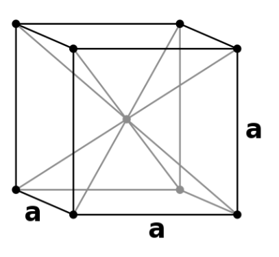
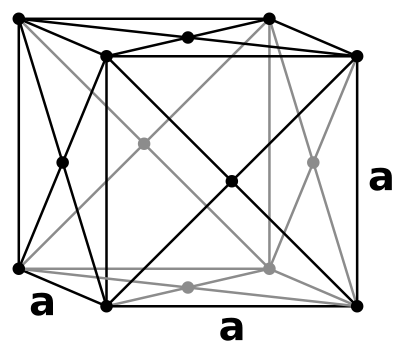
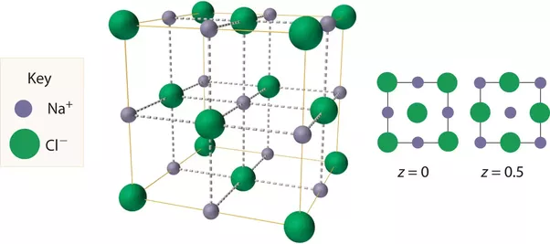
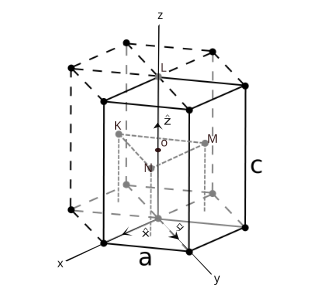
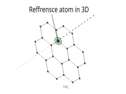
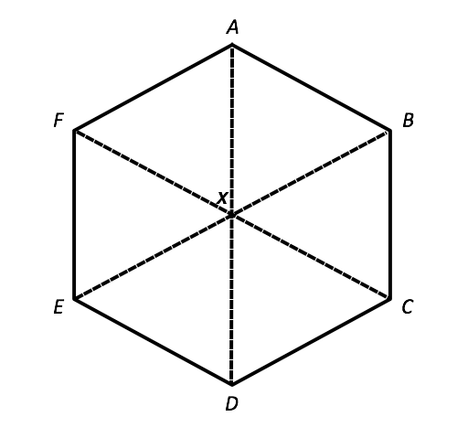

# Phy-322 Assignment

<!--toc:start-->
- [Phy-322 Assignment](#phy-322-assignment)
  - [Questions](#questions)
  - [Answers](#answers)
    - [1. Give all possible definitions of Crystal that you know.](#1-give-all-possible-definitions-of-crystal-that-you-know)
    - [2. Give two definitions of amorphous materials.](#2-give-two-definitions-of-amorphous-materials)
    - [3. Give three definitions of a lattice.](#3-give-three-definitions-of-a-lattice)
    - [4. Give two definitions of Bravais lattice.](#4-give-two-definitions-of-bravais-lattice)
    - [5. Define what is meant by basic/basis cell.](#5-define-what-is-meant-by-basicbasis-cell)
    - [6. List two definitions of the primitive unit cell.](#6-list-two-definitions-of-the-primitive-unit-cell)
    - [7. Draw the basic vector that represents the primitive unit cell in the following 3D order](#7-draw-the-basic-vector-that-represents-the-primitive-unit-cell-in-the-following-3d-order)
    - [8. Give full atomic coordinates of NaCl structure.](#8-give-full-atomic-coordinates-of-nacl-structure)
    - [10. Calculate the atomic packing fraction of](#10-calculate-the-atomic-packing-fraction-of)
      - [Hexagonal-Closed Packed structure](#hexagonal-closed-packed-structure)
      - [Packing Fraction](#packing-fraction)
<!--toc:end-->

## Questions
1. Give all possible definitions of Crystal that you know.
2. Give two definitions of amorphous materials.
3. Give three definitions of a lattice.
4. Give two definitions of Bravais lattice.
5. Define what is meant by basic/basis cell.
6. List two definitions of the primitive unit cell.
7. Draw the basic vector that represents the primitive unit cell in the following 3D order
  * Body-Centered Cubic (BCC)
  * Face-Centered Cubic (FCC)
  * Hexagonal-Closed Packed (HCP)
8. Give full atomic coordinates of NaCl structure.
9. Derive the atomic coordinates of the HCP structure other than the method used in class.
10. Calculate the atomic packing fraction of
  * Hexagonal Crystal lattice
  * Hexagonal-Closed Packed structure
11. Given the basic vector of Body-Centered Cubic lattice in real space with the expression.  
  $$a1 = \frac{a}{2}x + \frac{a}{2}y - \frac{a}{2}z$$
  $$a2 = -\frac{a}{2}x + \frac{a}{2}y + \frac{a}{2}z$$
  $$a3 = \frac{a}{2}x - \frac{a}{2}y + \frac{a}{2}z$$
  * Determine the reciprocal lattice vectors.
  * Draw the diagram of the Body-Centered System, showing the appropriate primitive basis vectors.

## Answers
### 1. Give all possible definitions of Crystal that you know.
  * A crystal or crystalline solid is a solid material whose constituents (such as atoms, molecules, or ions)
    are arranged in a highly ordered microscopic structure, forming a crystal lattice that extends in all directions.
  * A crystal is a solid material in which atoms, ions and molecules are arranged in regularly repeating pattern
     that extends in all three spatial dimensions,
  * A crystal is any solid crystalline substance, and thus has a regular and ordered internal arrangement of
     atoms, ions or molecules.
  * A crystal is a solid substance that is composed of atoms, ions, and molecules that are arranged in a regular
      geometric pattern.
    In general, "crystal" is used to describe materials that have a regular repeating and symmetrical atomic structure  
    _**Rerfrence** [Open AI Chat GPT-3](https://chat.openai.com/chat)_

### 2. Give two definitions of amorphous materials.
  * An amorphous material is a solid material that lacks long-range order in its atomic structure.
  * A solid in which the constituent particles do possess a regular three-dimensional arrangement.
  * An amorphous material can also be defined as a solid that has a somewhat random internal arrangement of atoms,
     ions and molecules, which gives them a glassy appearance.
  Examples of amorphous solids include glass, plastics, and many types of rubber.  
  _**Rerfrence** [Open AI Chat GPT-3](https://chat.openai.com/chat)_

### 3. Give three definitions of a lattice.
  * A lattice is a regularly repeating arrangement of points in three-dimensional space, that is usually occupied by
     atoms, ions or molecules.
  * A lattice can also be defined as a three-dimensional array of points that form a regular and repeating pattern.
  _**Rerfrence** [Open AI Chat GPT-3](https://chat.openai.com/chat)_
  * A set of mathematical points to which the crystal is attached.  
  _**Rerfrence** Solid State Physics Kittle_

### 4. Give two definitions of Bravais lattice.
  * A Bravais Lattice is an array of discrete points that look the same in all directions and orientations that look
    the same in all directions.  
   _**Reference** [byjus.com](https://byjus.com/chemistry/bravais-lattice/)_
  * A Bravais Lattice is the basic building block from which all crystals can be constructed. 
  _**Reference** [libretexts.org](https://chem.libretexts.org/Bookshelves/Analytical_Chemistry/Physical_Methods_in_Chemistry_and_Nano_Science_(Barron)/07%3A_Molecular_and_Solid_State_Structure/7.01%3A_Crystal_Structure)_

### 5. Define what is meant by basic/basis cell.
A basic cell or basis cell is the smallest unit cell that can be used to construct the entire crystal lattice without
gaps or overlaps. It is a three-dimensional structure that is repeated in a crystal lattice to
create the overall crystal structure. The basic cell is characterized by the lengths of its sides and the angles between
them, and it is used to define the fundamental geometry of the crystal lattice. The arrangement of atoms within the basic
cell determines the overall properties of the crystal, such as its hardness, electrical conductivity, and thermal conductivity.

### 6. List two definitions of the primitive unit cell.
  * A primitive unit cell is a basic building block of a crystal lattice. It is the smallest unit cell that can be used
    to construct the entire crystal lattice without gaps or overlaps.
  * A primitive unit cell is a three-dimensional structure that is repeated in a crystal lattice to create the overall
    crystal structure. It is the smallest unit cell that can be used to construct the entire crystal lattice without
    gaps or overlaps, and it is characterized by the lengths of its sides and the angles between them.
  _**Rerfrence** [Open AI Chat GPT-3](https://chat.openai.com/chat)_

### 7. Draw the basic vector that represents the primitive unit cell in the following 3D order
* Body-Centered Cubic (BCC)  
  

* Face-Centered Cubic (FCC)  

* Hexagonal-Closed Packed (HCP)  
![Hexagonal-Closed Packed lattice(./images/Hexagonal,_close_packed_crystal_lattice.png)

### 8. Give full atomic coordinates of NaCl structure.
Sodium chloride is an ionic compound with the chemical formula NaCl, representing a 1:1 ratio of Na and Cl$_2$ with molar masses
of 22.99 and 35.45 gmol$^{-1}$ respectively.

* NaCl has a Cubic-Closed Packed (CCP) arrangement.
* The structure of sodium chloride consists of eight ions in a unit cell, four are Na$^+$ ions and the other four are Cl$^-$  
In this structure, each corner of the ion is shared between eight unit cells, each ion at the faces of each cell is shared between
two cells, each ion on an edge is shared between four cells, while the ion inside the cell belongs entirely to that unit cell.
So the position of the ions is the following(with Na at the center of the axis):
* **Na$^+$**   (0 0 0) ($\frac{1}{2}$ $\frac{1}{2}$ 0) ($\frac{1}{2}$ 0 $\frac{1}{2}$) (0 $\frac{1}{2}$ $\frac{1}{2}$)
* **Cl$^-$**   (0 $\frac{1}{2}$ 0) ($\frac{1}{2}$ 0 0) (0 0 $\frac{1}{2}$) ($\frac{1}{2}$ $\frac{1}{2}$ $\frac{1}{2}$)

### 10. Calculate the atomic packing fraction of
  * Hexagonal Crystal lattice
  * Hexagonal-Closed Packed structure

#### Hexagonal-Closed Packed structure
Consider the diagram bellow  
  
From the diagram above we notice that each atom at the edge of the hexagon is shared between six cells
  
* 3 cells at the top
* 3 cells at the bottom  
$-$ each of the 12 edge atoms contributes a total of $\frac{1}{6}$ atoms to the cell  
$$\frac{1}{6} \times 12 = 2\ (for\ the\ edge\ atoms)$$
$-$ we can also see that each of the face atoms is being shared between two adjacent unit cells, thus the two face atoms
(at the top and the bottom), contribute a total of $\frac{1}{2}$ atoms.
$$\frac{1}{2} \times 2 = 1\ (for\ the\ face\ atoms)$$
$-$ we also see that the three inner atoms are not shared with any other unit cell and thus contribute a full atom each to the
unit cell
$$1 \times 3 = 3\ (for\ the\ inner\ atoms)$$
this means the effective number of atoms $z$ in HCP is 
$$2 + 1 + 3 = 6atoms$$

#### Packing Fraction
  the packing fraction of a Hexagonal-Closed Packed structure is given by  
  $$ PF = \frac{volume\ occupied\ by\ the\ atoms}{volume\ of\ the\ unit\ cell}$$
- Solving for the volume occupied by the atoms in the cell  
> the total volume $v_a$ occupied by atoms in a unit cell is given by
> $$ v_a = z \times volume\ of\ an\ atom$$  
> where $z$ is the effective number of atoms in the cell  
> and $v_a$ is the total volume occupied by atoms in a unit cell  
  $$ v_a = 6 \times \frac{4}{3} \pi r^3$$
- Solving for the volume of the unit cell

> the volume of the unit cell $v_u$ for HCP is given by  
> $$ v_u = area\ of\ the\ base \times height(c)$$
> - calculating the area of the base hexagon
> consider the hexagon bellow
>   
> from the above diagram, we can see that six equilateral triangles make up the hexagons, therefore the area of one triangle
> multiplied by 6 will give us the area of the hexagon
