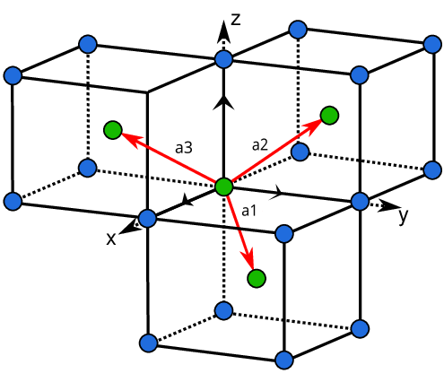

::: {#title-block-header}
# Physics Assignment {#physics-assignment .title}
:::

::: first_page
# Federal University of Technology Minna

\

## Geology Department

\

### Answers to Physics 322 Assignment

By Geology Department (Group 5)
:::

::: grp_members
### Group 5

:::

# Phy-322 Assignment

-   [Phy-322 Assignment](#phy-322-assignment)
    -   [Questions](#questions)

    -   [Answers](#answers)
        -   [1. Give all possible definitions of Crystal that you
            know.](#1-give-all-possible-definitions-of-crystal-that-you-know)
        -   [2. Give two definitions of amorphous
            materials.](#2-give-two-definitions-of-amorphous-materials)
        -   [3. Give three definitions of a
            lattice.](#3-give-three-definitions-of-a-lattice)
        -   [4. Give two definitions of Bravais
            lattice.](#4-give-two-definitions-of-bravais-lattice)
        -   [5. Define what is meant by basic/basis
            cell.](#5-define-what-is-meant-by-basicbasis-cell)
        -   [6. List two definitions of the primitive unit
            cell.](#6-list-two-definitions-of-the-primitive-unit-cell)
        -   [7. Draw the basic vector that represents the primitive unit
            cell in the following 3D
            order](#7-draw-the-basic-vector-that-represents-the-primitive-unit-cell-in-the-following-3d-order)
        -   [8. Give full atomic coordinates of the Cesium Chloride
            (CsCl)
            structure.](#8-give-full-atomic-coordinates-of-the-cesium-chloride-cscl-structure)
        -   [9. Derive the atomic coordinates of the HCP structure other
            than the method used in
            class.](#9-derive-the-atomic-coordinates-of-the-hcp-structure-other-than-the-method-used-in-class)
        -   [10. Calculate the atomic packing fraction
            of](#10-calculate-the-atomic-packing-fraction-of)
            -   [Hexagonal-Closed Packed
                structure](#hexagonal-closed-packed-structure)
            -   [Packing Fraction](#packing-fraction)
        -   [11. Given the basic vector of Body-Centered Cubic lattice
            in real space with the
            expression.](#11-given-the-basic-vector-of-body-centered-cubic-lattice-in-real-space-with-the-expression)
            -   [I. Determine the reciprocal lattice
                vectors.](#i-determine-the-reciprocal-lattice-vectors)

    -   [[\\\[ \\therefore \\vec a_2 \\times \\vec a_3 =
        \\frac{a\^2}{2}(\\hat x + \\hat y)\\\]]{.math .display}
        ---](#therefore-vec-a2-times-vec-a3-fraca22hat-x-hat-y)

    -   [[\\\[ \\therefore \\vec a_1 \\cdot (\\vec a_2 \\times \\vec
        a_3) = \\frac{a\^3}{2}\\\]]{.math .display}\
        ---](#therefore-vec-a1-cdot-vec-a2-times-vec-a3-fraca32)

    -   [[\\\[ \\therefore \\vec a_3 \\times \\vec a_1 =
        \\frac{a\^2}{2}(\\vec y + \\vec z)\\\]]{.math .display}
        ---](#therefore-vec-a3-times-vec-a1-fraca22vec-y-vec-z)

    -   
          \[[\\\[\\therefore \\vec a_1 \\times \\vec a_2 \\ = \\frac{a\^2}{2}(\\hat x + \\hat y)\\\]]{.math .display}
          -----------------------------------------------------------------------------------------------------------------------------------------------------------------------------------------------------------
          \](#therefore-vec-a1-times-vec-a2-fraca22hat-x-hat-y)
          \- [The reciprocal lattice of BCC are](#the-reciprocal-lattice-of-bcc-are)
          \- [II. Draw the diagram of the Body-Centered System, showing the appropriate primitive basis vectors.](#ii-draw-the-diagram-of-the-body-centered-system-showing-the-appropriate-primitive-basis-vectors)

## Questions

1.  Give all possible definitions of Crystal that you know.
2.  Give two definitions of amorphous materials.
3.  Give three definitions of a lattice.
4.  Give two definitions of Bravais lattice.
5.  Define what is meant by basic/basis cell.
6.  List two definitions of the primitive unit cell.
7.  Draw the basic vector that represents the primitive unit cell in the
    following 3D order

-   Body-Centered Cubic (BCC)
-   Face-Centered Cubic (FCC)
-   Hexagonal-Closed Packed (HCP)

8.  8.  Give full atomic coordinates of Cesium Chloride (CeCl)
        structure.

9.  Derive the atomic coordinates of the HCP structure other than the
    method used in class.

10. Calculate the atomic packing fraction of

-   Hexagonal Crystal lattice
-   Hexagonal-Closed Packed structure

11. Given the basic vector of Body-Centered Cubic lattice in real space
    with the expression.\
    [\\\[a1 = \\frac{a}{2}x + \\frac{a}{2}y - \\frac{a}{2}z\\\]]{.math
    .display} [\\\[a2 = -\\frac{a}{2}x + \\frac{a}{2}y +
    \\frac{a}{2}z\\\]]{.math .display} [\\\[a3 = \\frac{a}{2}x -
    \\frac{a}{2}y + \\frac{a}{2}z\\\]]{.math .display}

-   Determine the reciprocal lattice vectors.
-   Draw the diagram of the Body-Centered System, showing the
    appropriate primitive basis vectors.

## Answers

### 1. Give all possible definitions of Crystal that you know.

-   A crystal or crystalline solid is a solid material whose
    constituents (such as atoms, molecules, or ions) are arranged in a
    highly ordered microscopic structure, forming a crystal lattice that
    extends in all directions.
-   A crystal is a solid material in which atoms, ions and molecules are
    arranged in regularly repeating pattern that extends in all three
    spatial dimensions,
-   A crystal is any solid crystalline substance, and thus has a regular
    and ordered internal arrangement of atoms, ions or molecules.
-   A crystal is a solid substance that is composed of atoms, ions, and
    molecules that are arranged in a regular geometric pattern. In
    general, "crystal" is used to describe materials that have a regular
    repeating and symmetrical atomic structure\
    ***Rerfrence** [Open AI Chat GPT-3](https://chat.openai.com/chat)*

### 2. Give two definitions of amorphous materials.

-   An amorphous material is a solid material that lacks long-range
    order in its atomic structure.
-   A solid in which the constituent particles do possess a regular
    three-dimensional arrangement.
-   An amorphous material can also be defined as a solid that has a
    somewhat random internal arrangement of atoms, ions and molecules,
    which gives them a glassy appearance. Examples of amorphous solids
    include glass, plastics, and many types of rubber.\
    ***Rerfrence** [Open AI Chat GPT-3](https://chat.openai.com/chat)*

### 3. Give three definitions of a lattice.

-   A lattice is a regularly repeating arrangement of points in
    three-dimensional space, that is usually occupied by atoms, ions or
    molecules.
-   A lattice can also be defined as a three-dimensional array of points
    that form a regular and repeating pattern. ***Rerfrence** [Open AI
    Chat GPT-3](https://chat.openai.com/chat)*
-   A set of mathematical points to which the crystal is attached.\
    ***Rerfrence** Solid State Physics Kittle*

### 4. Give two definitions of Bravais lattice.

-   A Bravais Lattice is an array of discrete points that look the same
    in all directions and orientations that look the same in all
    directions.\
    ***Reference**
    [byjus.com](https://byjus.com/chemistry/bravais-lattice/)*
-   A Bravais Lattice is the basic building block from which all
    crystals can be constructed. ***Reference**
    [libretexts.org](https://chem.libretexts.org/Bookshelves/Analytical_Chemistry/Physical_Methods_in_Chemistry_and_Nano_Science_(Barron)/07%3A_Molecular_and_Solid_State_Structure/7.01%3A_Crystal_Structure)*

### 5. Define what is meant by basic/basis cell.

A basic cell or basis cell is the smallest unit cell that can be used to
construct the entire crystal lattice without gaps or overlaps. It is a
three-dimensional structure that is repeated in a crystal lattice to
create the overall crystal structure. The basic cell is characterized by
the lengths of its sides and the angles between them, and it is used to
define the fundamental geometry of the crystal lattice. The arrangement
of atoms within the basic cell determines the overall properties of the
crystal, such as its hardness, electrical conductivity, and thermal
conductivity.

### 6. List two definitions of the primitive unit cell.

-   A primitive unit cell is a basic building block of a crystal
    lattice. It is the smallest unit cell that can be used to construct
    the entire crystal lattice without gaps or overlaps.
-   A primitive unit cell is a three-dimensional structure that is
    repeated in a crystal lattice to create the overall crystal
    structure. It is the smallest unit cell that can be used to
    construct the entire crystal lattice without gaps or overlaps, and
    it is characterized by the lengths of its sides and the angles
    between them. ***Rerfrence** [Open AI Chat
    GPT-3](https://chat.openai.com/chat)*

### 7. Draw the basic vector that represents the primitive unit cell in the following 3D order

-   Body-Centered Cubic (BCC)\
    

-   Face-Centered Cubic (FCC)\
    

-   Hexagonal-Closed Packed (HCP)\
    !\[Hexagonal-Closed Packed
    lattice(./images/Hexagonal,\_close_packed_crystal_lattice.png)

### 8. Give full atomic coordinates of the Cesium Chloride (CsCl) structure.

Cesium chloride (CsCl) has a Body-Centered structure.  \* It has two primitive cells in
a cubic unit and each unit cell has two molecule basis of CsCl. \* The
position of the Cl ion is at (0 0 0) and the Cs ion is at
([\\(\\frac{1}{2} \\frac{1}{2} \\frac{1}{2}\\)]{.math .inline}) \* The
Cs are situated at the body center and the eight Cl ions are at the
corner of the unit cell. Similarly, if we extend the unit cell we can
see a Cl ion is surrounded by 8 Cs ions. Thus the coordinate number of
CsCl is 8.

### 9. Derive the atomic coordinates of the HCP structure other than the method used in class.

\
From the above diagram, we can see that the Hexagonal-Closed Packed
structure has a Coordination number of twelve(12).

### 10. Calculate the atomic packing fraction of

-   Hexagonal Crystal lattice
-   Hexagonal-Closed Packed structure #### Hexagonal Crystal lattice
    Consider the diagram bellow\
    \
    From the diagram above we notice that each atom at the edge of the
    hexagon is shared between six cells \
-   3 cells at the top
-   3 cells at the bottom\
    [\\(-\\)]{.math .inline} each of the 12 edge atoms contributes a
    total of [\\(\\frac{1}{6}\\)]{.math .inline} atoms to the cell\
    [\\\[\\frac{1}{6} \\times 12 = 2\\ (for\\ the\\ edge\\
    atoms)\\\]]{.math .display} [\\(-\\)]{.math .inline} we can also see
    that each of the face atoms is being shared between two adjacent
    unit cells, thus the two face atoms (at the top and the bottom),
    contribute a total of [\\(\\frac{1}{2}\\)]{.math .inline} atoms.
    [\\\[\\frac{1}{2} \\times 2 = 1\\ (for\\ the\\ face\\
    atoms)\\\]]{.math .display} [\\(-\\)]{.math .inline} we also see
    that the three inner atoms are not shared with any other unit cell
    and thus contribute a full atom each to the unit cell [\\\[1 \\times
    3 = 3\\ (for\\ the\\ inner\\ atoms)\\\]]{.math .display} this means
    the effective number of atoms [\\(z\\)]{.math .inline} in HCP is
    [\\\[2 + 1 + 3 = 6atoms\\\]]{.math .display}

#### Packing Fraction

the packing fraction of a Hexagonal-Closed Packed structure is given by\
[\\\[ PF = \\frac{volume\\ occupied\\ by\\ the\\ atoms}{volume\\ of\\
the\\ unit\\ cell}\\\]]{.math .display} - Solving for the volume
occupied by the atoms in the cell\
the total volume [\\(v_a\\)]{.math .inline} occupied by atoms in a unit
cell is given by [\\\[ v_a = z \\times volume\\ of\\ an\\
atom\\\]]{.math .display}\
where [\\(z\\)]{.math .inline} is the effective number of atoms in the
cell\
and [\\(v_a\\)]{.math .inline} is the total volume occupied by atoms in
a unit cell\
[\\\[ v_a = 6 \\times \\frac{4}{3} \\pi r\^3\\\]]{.math .display} -
Solving for the volume of the unit cell

the volume of the unit cell [\\(v_u\\)]{.math .inline} for HCP is given
by\
[\\\[ v_u = area\\ of\\ the\\ base \\times height(C)\\\]]{.math
.display} - calculating the area of the base hexagon consider the
hexagon bellow \
from the above diagram, we can see that six equilateral triangles make
up the hexagons, therefore the area of one triangle multiplied by 6 will
give us the area of the hexagon the area of a triangle is
[\\(\\frac{1}{2}base \\times h\\)]{.math .inline}  from the diagram above,
the distance between two touching atoms [\\(a = 2r\\)]{.math .inline}\
using pythagoras theorem we can solve for the height of the triangle\
[\\\[a\^2 = (\\frac{1}{2}a)\^2 \\times h\^2\\\]]{.math .display} [\\\[h
= \\frac{a\\sqrt{3}}{4}\\\]]{.math .display} thus the area of the
triangle [\\(A\\)]{.math .inline} is\
[\\\[ A = \\frac{1}{2} \\times a \\times (\\frac{1}{2}a)\^2 \\times
h\^2\\\]]{.math .display} [\\\[ = \\frac{\\sqrt{3}a\^2}{4}\\\]]{.math
.display} multiplied by 6, the area of the hexagon [\\(A_h\\)]{.math
.inline} is [\\\[ A_h = \\frac{3\\sqrt{3}a\^2}{2}\\\]]{.math .display}
the volume of HCP = [\\(A_h \\times C\\)]{.math .inline} whre
[\\(C\\)]{.math .inline} is the height of the HCP lattice\
[\\\[C = \\frac{4r\\sqrt{2}}{\\sqrt{3}}\\\]]{.math .display}

[\\\[\\therefore PF = \\frac{6 \\times \\frac{4}{3}\\pi \\times
(\\frac{a}{3})\^3}{\\frac{3a\^2\\sqrt{3}}{2} \\times C}\\\]]{.math
.display} [\\\[the\\ atomic\\ packing\\ fraction\\ PF = 0.75\\\]]{.math
.display}

#### Hexagonal-Closed Packed structure

Consider the diagram bellow\
\
From the diagram above we notice that each atom at the edge of the
hexagon is shared between six cells \
\* 3 cells at the top \* 3 cells at the bottom\
[\\(-\\)]{.math .inline} each of the 12 edge atoms contributes a total
of [\\(\\frac{1}{6}\\)]{.math .inline} atoms to the cell\
[\\\[\\frac{1}{6} \\times 12 = 2\\ (for\\ the\\ edge\\ atoms)\\\]]{.math
.display} [\\(-\\)]{.math .inline} we can also see that each of the face
atoms is being shared between two adjacent unit cells, thus the two face
atoms (at the top and the bottom), contribute a total of
[\\(\\frac{1}{2}\\)]{.math .inline} atoms. [\\\[\\frac{1}{2} \\times 2 =
1\\ (for\\ the\\ face\\ atoms)\\\]]{.math .display} [\\(-\\)]{.math
.inline} we also see that the three inner atoms are not shared with any
other unit cell and thus contribute a full atom each to the unit cell
[\\\[1 \\times 3 = 3\\ (for\\ the\\ inner\\ atoms)\\\]]{.math .display}
this means the effective number of atoms [\\(z\\)]{.math .inline} in HCP
is [\\\[2 + 1 + 3 = 6atoms\\\]]{.math .display}

#### Packing Fraction

the packing fraction of a Hexagonal-Closed Packed structure is given by\
[\\\[ PF = \\frac{volume\\ occupied\\ by\\ the\\ atoms}{volume\\ of\\
the\\ unit\\ cell}\\\]]{.math .display} - Solving for the volume
occupied by the atoms in the cell\
the total volume [\\(v_a\\)]{.math .inline} occupied by atoms in a unit
cell is given by [\\\[ v_a = z \\times volume\\ of\\ an\\
atom\\\]]{.math .display}\
where [\\(z\\)]{.math .inline} is the effective number of atoms in the
cell\
and [\\(v_a\\)]{.math .inline} is the total volume occupied by atoms in
a unit cell\
[\\\[ v_a = 6 \\times \\frac{4}{3} \\pi r\^3\\\]]{.math .display} -
Solving for the volume of the unit cell

the volume of the unit cell [\\(v_u\\)]{.math .inline} for HCP is given
by\
[\\\[ v_u = area\\ of\\ the\\ base \\times height(C)\\\]]{.math
.display} - calculating the area of the base hexagon consider the
hexagon bellow \
from the above diagram, we can see that six equilateral triangles make
up the hexagons, therefore the area of one triangle multiplied by 6 will
give us the area of the hexagon the area of a triangle is
[\\(\\frac{1}{2}base \\times h\\)]{.math .inline}  from the diagram above,
the distance between two touching atoms [\\(a = 2r\\)]{.math .inline}\
using pythagoras theorem we can solve for the height of the triangle\
[\\\[a\^2 = (\\frac{1}{2}a)\^2 \\times h\^2\\\]]{.math .display} [\\\[h
= \\frac{a\\sqrt{3}}{4}\\\]]{.math .display} thus the area of the
triangle [\\(A\\)]{.math .inline} is\
[\\\[ A = \\frac{1}{2} \\times a \\times (\\frac{1}{2}a)\^2 \\times
h\^2\\\]]{.math .display} [\\\[ = \\frac{\\sqrt{3}a\^2}{4}\\\]]{.math
.display} multiplied by 6, the area of the hexagon [\\(A_h\\)]{.math
.inline} is [\\\[ A_h = \\frac{3\\sqrt{3}a\^2}{2}\\\]]{.math .display}
the volume of HCP = [\\(A_h \\times C\\)]{.math .inline} whre
[\\(C\\)]{.math .inline} is the height of the HCP lattice\
[\\\[C = \\frac{4r\\sqrt{2}}{\\sqrt{3}}\\\]]{.math .display}

[\\\[\\therefore PF = \\frac{6 \\times \\frac{4}{3}\\pi \\times
(\\frac{a}{3})\^3}{\\frac{3a\^2\\sqrt{3}}{2} \\times C}\\\]]{.math
.display} [\\\[the\\ atomic\\ packing\\ fraction\\ PF = 0.75\\\]]{.math
.display} [\\\[the\\ atomic\\ packing\\ percentage\\ = 75\\%\\\]]{.math
.display}

### 11. Given the basic vector of Body-Centered Cubic lattice in real space with the expression.

[\\\[a1 = \\frac{a}{2}x + \\frac{a}{2}y - \\frac{a}{2}z\\\]]{.math
.display} [\\\[a2 = -\\frac{a}{2}x + \\frac{a}{2}y +
\\frac{a}{2}z\\\]]{.math .display} [\\\[a3 = \\frac{a}{2}x -
\\frac{a}{2}y + \\frac{a}{2}z\\\]]{.math .display}

#### I. Determine the reciprocal lattice vectors.

\
The Reciprocal lattice of BCC are given by: [\\\[ \\vec a_1 =
\\frac{2\\pi(\\vec a_2 \\times \\vec a_3)}{\\vec a_1 \\cdot (\\vec a_2
\\times \\vec a_3)} \\ \\ \\vec a_2 = \\frac{2\\pi(\\vec a_3 \\times
\\vec a_1)}{\\vec a_1 \\cdot (\\vec a_2 \\times \\vec a_3)} \\ \\ \\vec
a_3 = \\frac{2\\pi(\\vec a_1 \\times \\vec a_2)}{\\vec a_1 \\cdot (\\vec
a_2 \\times \\vec a_3)} \\\]]{.math .display} [\\\[ \\vec a_2 \\times
\\vec a_3 = \\frac{a}{2}(-\\hat x -\\hat y + \\hat z) \\times
\\frac{a}{2}(\\hat x - \\hat y + \\hat z)\\\]]{.math .display} [\\\[ =
\\frac{a\^2}{4}\\begin{bmatrix} \\hat x & \\hat y & \\hat z \\\\ -1 & 1
& 1 \\\\ 1 & -1 & 1 \\end{bmatrix} \\ = \\frac{a\^2}{4}\\cdot \\hat
x\\begin{bmatrix}1 & 1\\\\ -1 & 1 \\end{bmatrix} -\\hat
y\\begin{bmatrix} -1 & 1 \\\\ 1 & 1 \\end{bmatrix} +\\hat
x\\begin{bmatrix} -1 & 1 \\\\ 1 & 1 \\end{bmatrix} \\\]]{.math .display}
[\\\[ \\vec a_2 \\times \\vec a_3 = \\frac{a\^3}{4}\\cdot \\hat x(1 + 1)
-\\hat y(-1 -1) + \\hat z(1 - 1)\\\]]{.math .display} [\\\[ =
\\frac{a\^2}{4}\\cdot 2\\hat x + 2\\hat y\\ \\ \\ =
\\frac{a\^2}{x}\\cdot 2(\\hat x + \\hat y) \\ \\ \\
=\\frac{a\^2}{2}(\\hat x + \\hat y)\\\]]{.math .display}

  ---------------------------------------------------------------------------------------------------------
  [\\\[ \\therefore \\vec a_2 \\times \\vec a_3 = \\frac{a\^2}{2}(\\hat x + \\hat y)\\\]]{.math .display}
  ---------------------------------------------------------------------------------------------------------

[\\\[ \\vec a_1 \\cdot (\\vec a_2 \\times a_3) = \\frac{a}{2}(\\hat x +
\\hat y - \\hat z) \\cdot \\frac{a\^2}{2}(\\hat x + \\hat y)\\\]]{.math
.display} [\\\[ = \\frac{a\^3}{4}(\\hat x \\cdot \\hat x + \\hat y
\\cdot \\hat y) \\ \\ \\ = \\frac{a\^3}{4}(1 + 1) \\ \\ \\ =
\\frac{a\^3}{4}(2) \\ \\ \\ = \\frac{a\^3}{2}\\\]]{.math .display}

  ---------------------------------------------------------------------------------------------------------
  [\\\[ \\therefore \\vec a_1 \\cdot (\\vec a_2 \\times \\vec a_3) = \\frac{a\^3}{2}\\\]]{.math .display}
  ---------------------------------------------------------------------------------------------------------

[\\\[ \\vec a_3 \\times \\vec a_1 = \\frac{a}{2}(\\hat x - \\hat y +
\\hat z) \\times \\frac{a}{2}(\\hat x + \\hat y - \\hat z)\\\]]{.math
.display} [\\\[ = \\frac{a\^2}{4}(\\hat x - \\hat y + \\hat z) \\times
(\\hat x + \\hat y - \\hat z)\\\]]{.math .display} [\\\[ =
\\frac{a\^2}{4} \\begin{bmatrix} \\hat x & \\hat y & \\hat z \\\\ 1 & -1
& 1 \\\\ 1 & 1 & -1 \\end{bmatrix} \\ \\ = \\frac{a\^2}{4} \\cdot
\\begin{bmatrix} \\vec x \\begin{bmatrix} -1 & 1 \\\\ 1 & -1
\\end{bmatrix} -\\vec y \\begin{bmatrix} 1 & 1 \\\\ 1 & -1
\\end{bmatrix} +\\vec z \\begin{bmatrix} 1 & -1 \\\\ 1 & 1
\\end{bmatrix} \\end{bmatrix} \\\]]{.math .display} [\\\[ \\vec a_3
\\times \\vec a_1 = \\frac{a\^2}{4} \\cdot \\begin{bmatrix} \\hat x(1
-1) -\\hat y(-1-1) + \\hat z(1 + 1) \\end{bmatrix} \\\]]{.math .display}
[\\\[ = \\frac{a\^2}{4} \\cdot \\begin{bmatrix} \\hat x(0) -\\hat y(-2)
+ \\hat z(2) \\end{bmatrix}\\\]]{.math .display} [\\\[ = \\frac{a\^2}{4}
\\cdot 2\\hat y + 2\\hat z \\ \\ = \\frac{a\^3}{4} \\cdot 2(\\hat y +
\\hat z) \\ \\ = \\frac{a\^3}{2}(\\hat y + \\hat z) \\\]]{.math
.display}

  ---------------------------------------------------------------------------------------------------------
  [\\\[ \\therefore \\vec a_3 \\times \\vec a_1 = \\frac{a\^2}{2}(\\vec y + \\vec z)\\\]]{.math .display}
  ---------------------------------------------------------------------------------------------------------

[\\\[ \\vec a_1 \\times \\vec a_2 = \\frac{a}{2}(\\hat x + \\hat y +
\\hat z) \\times \\frac{a}{2}(-\\hat x + \\hat y + \\hat z)\\\]]{.math
.display} [\\\[ = \\frac{a\^2}{4}(\\hat x + \\hat y -\\hat z) \\times
(-\\hat x + \\hat y + \\hat z)\\\]]{.math .display} [\\\[ =
\\frac{a\^2}{4} \\begin{bmatrix} \\hat x & \\hat y & \\hat z \\\\ 1 & 1
& -1 \\\\ -1 & 1 & 1 \\end{bmatrix} \\ \\ \\ = \\frac{a\^2}{4} \\cdot
\\begin{bmatrix} \\hat x\\begin{bmatrix} 1 & -1 \\\\ 1 & 1
\\end{bmatrix} -\\hat y \\begin{bmatrix} 1 & -1 \\\\ -1 & 1
\\end{bmatrix} +\\hat z \\begin{bmatrix} 1 & 1 \\\\ -1 & 1
\\end{bmatrix} \\end{bmatrix} \\\]]{.math .display} [\\\[ \\vec a_1
\\times \\vec a_2 = \\frac{a\^2}{4} \\cdot \\begin{bmatrix} \\hat x(1 +
1) -\\hat y(1 - 1) + \\hat z(1 + 1) \\end{bmatrix} \\\]]{.math .display}
[\\\[ = \\frac{a\^2}{4}\\begin{bmatrix} 2\\vec x + 2\\vec z
\\end{bmatrix} \\ \\ = \\frac{a\^2}{4}\\cdot 2(\\hat x + \\hat z) \\ \\
= \\frac{a\^2}{2}\\cdot (\\hat x + \\hat z) \\\]]{.math .display}

  -----------------------------------------------------------------------------------------------------------
  [\\\[\\therefore \\vec a_1 \\times \\vec a_2 \\ = \\frac{a\^2}{2}(\\hat x + \\hat y)\\\]]{.math .display}
  -----------------------------------------------------------------------------------------------------------

#### The reciprocal lattice of BCC are

[\\\[\\vec a_1 = \\frac{2\\pi(\\vec a_2 \\times \\vec a_3)}{a_1\\cdot
(\\vec a_2 \\times \\vec a_3)} \\ \\ \\ = \\frac{2\\pi\\cdot
\\frac{a\^2}{2}(\\hat x + \\hat y)}{\\frac{a\^3}{2}} \\ \\ \\ =
\\frac{\\pi a\^3(\\hat x + \\hat y)}{\\frac{a\^3}{2}} \\ \\ \\ =
\\frac{2\\pi}{a}(\\hat x + \\hat y) \\\]]{.math .display} [\\\[\\vec a_2
= \\frac{2\\pi(\\vec a_3 \\times \\vec a_1)}{a_1\\cdot (\\vec a_2
\\times \\vec a_3)} \\ \\ \\ = \\frac{2\\pi\\cdot \\frac{a\^2}{2}(\\hat
y + \\hat z)}{\\frac{a\^3}{2}} \\ \\ \\ = \\frac{\\pi a\^3(\\hat y +
\\hat z)}{\\frac{a\^3}{2}} \\ \\ \\ = \\frac{2\\pi}{a}(\\hat y + \\hat
z) \\\]]{.math .display} [\\\[\\vec a_2 = \\frac{2\\pi(\\vec a_1 \\times
\\vec a_2)}{a_1\\cdot (\\vec a_2 \\times \\vec a_3)} \\ \\ \\ =
\\frac{2\\pi\\cdot \\frac{a\^2}{2}(\\hat x + \\hat z)}{\\frac{a\^3}{2}}
\\ \\ \\ = \\frac{\\pi a\^3(\\hat x + \\hat z)}{\\frac{a\^3}{2}} \\ \\
\\ = \\frac{2\\pi}{a}(\\hat x + \\hat z) \\\]]{.math .display}

#### II. Draw the diagram of the Body-Centered System, showing the appropriate primitive basis vectors.

     BCC System showing appropriate primitive basis vectors.

Source [Research
Gate](https://www.researchgate.net/figure/The-body-centred-cubic-BCC-reciprocal-lattice-of-a-FCC-lattice-shown-in-Fig-13_fig2_264872465)
